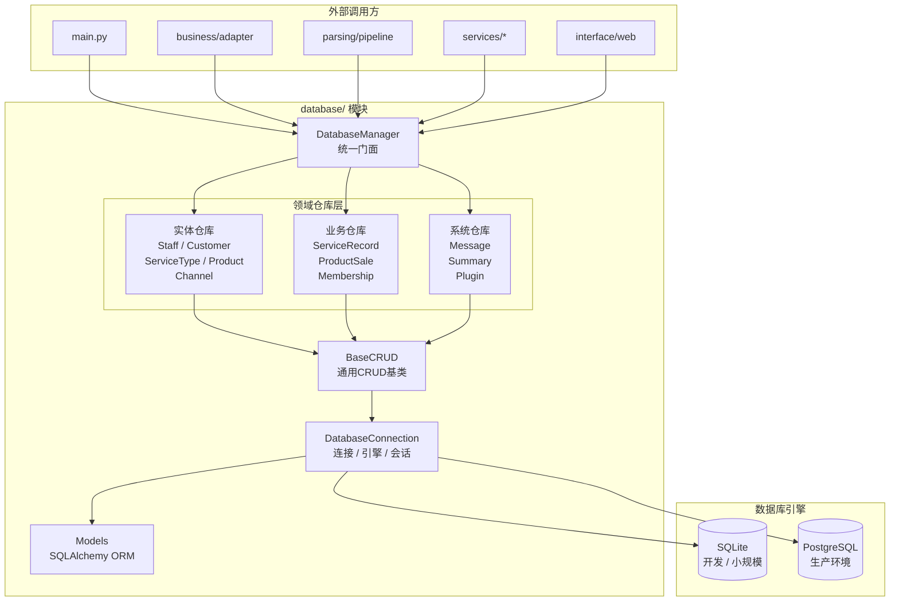
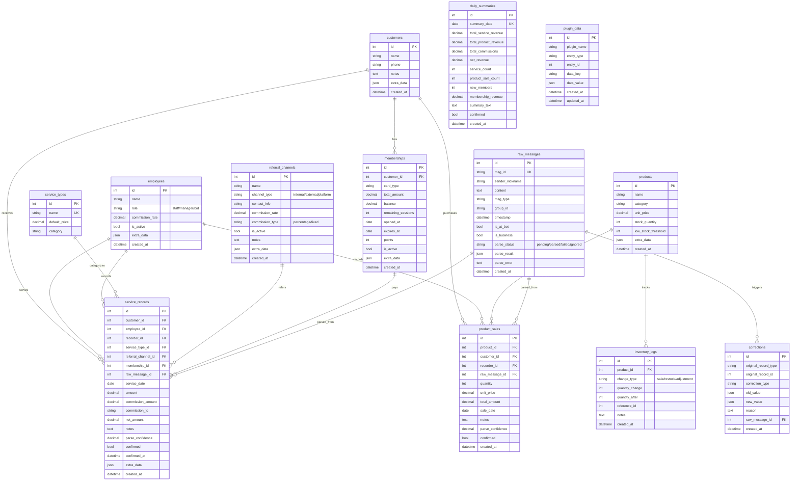
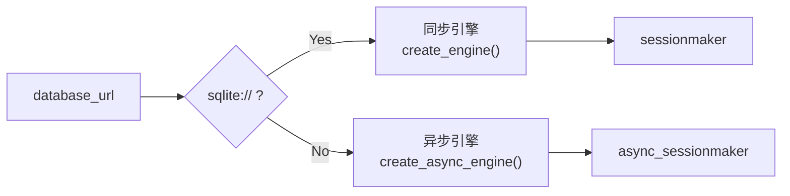
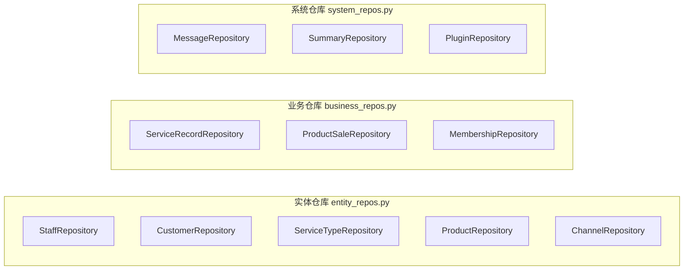
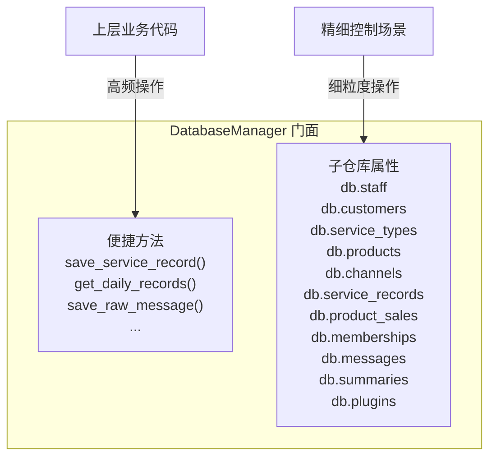
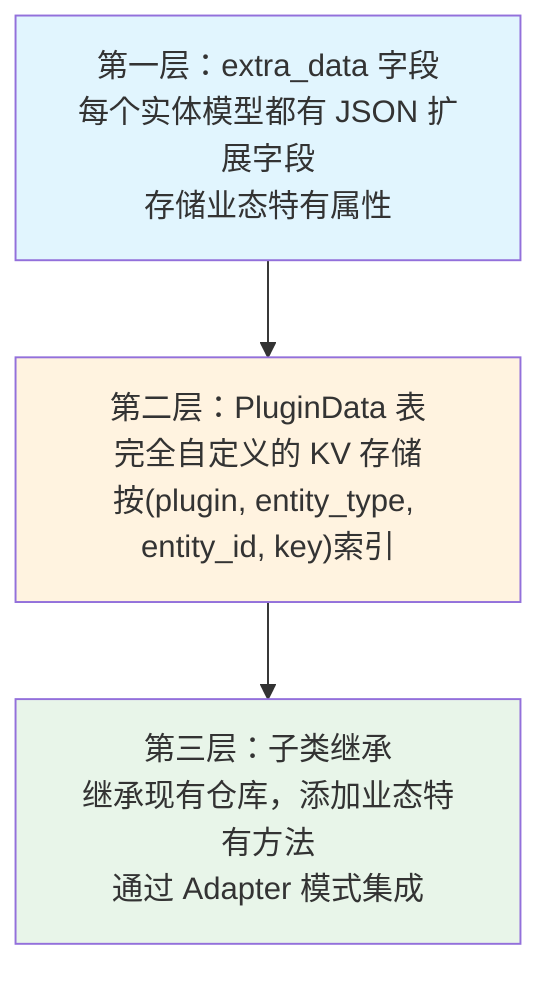
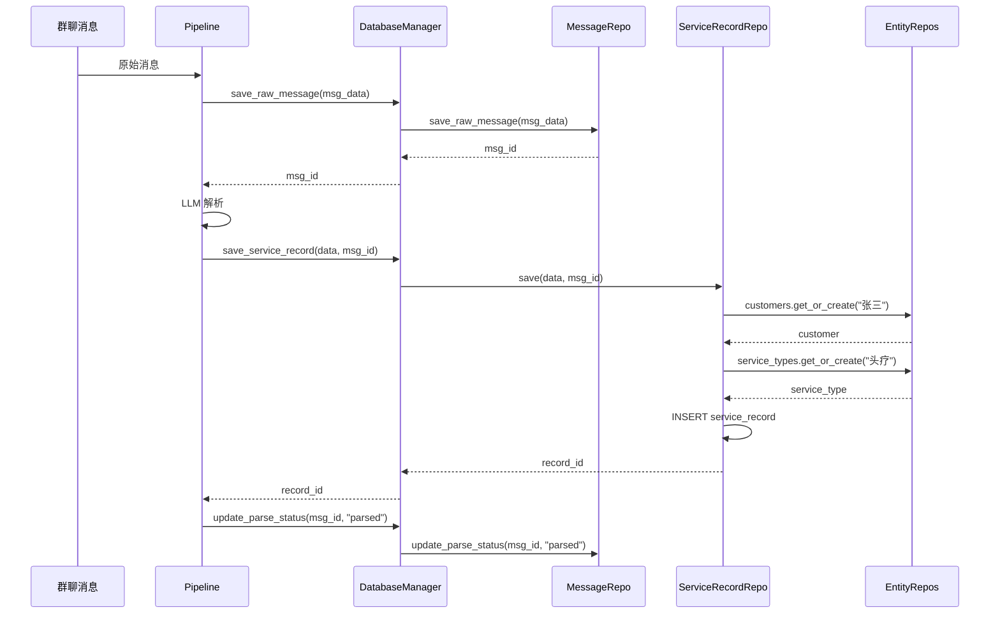
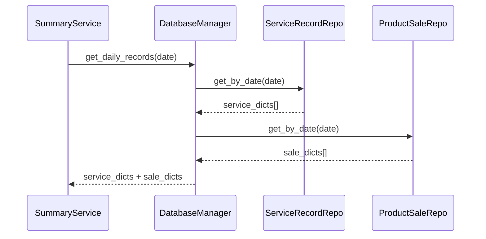

# Database 模块设计文档

## 1. 模块概述

`database/` 是一个**独立的数据库访问层模块**，采用 **Repository + Facade** 模式，将数据库操作按职责分层，提供统一的数据访问接口。

### 设计目标

- **业务与基础操作分离**：数据库连接管理与业务数据操作完全解耦
- **多业态适配**：抽象出商业模式共性（理发店、健身房、理疗馆、餐厅等）
- **可扩展性**：通过子仓库继承、`extra_data` 字段、`PluginData` 表支持业态细分
- **模块独立性**：`database/` 可单独使用，不依赖 `agent/`、`business/`、`interface/` 等模块

---

## 2. 架构分层



---

## 3. 模块文件结构

```
database/
├── __init__.py          # 模块入口，统一导出
├── models.py            # SQLAlchemy ORM 模型定义
├── connection.py        # 数据库连接与引擎管理
├── base_crud.py         # 通用 CRUD 操作基类
├── entity_repos.py      # 实体仓库（员工、顾客、服务类型、商品、渠道）
├── business_repos.py    # 业务仓库（服务记录、商品销售、会员卡）
├── system_repos.py      # 系统仓库（消息、汇总、插件数据）
└── manager.py           # DatabaseManager 统一门面
```

---

## 4. 类关系图

```mermaid
classDiagram
    class DatabaseManager {
        +conn: DatabaseConnection
        +staff: StaffRepository
        +customers: CustomerRepository
        +service_types: ServiceTypeRepository
        +products: ProductRepository
        +channels: ChannelRepository
        +service_records: ServiceRecordRepository
        +product_sales: ProductSaleRepository
        +memberships: MembershipRepository
        +messages: MessageRepository
        +summaries: SummaryRepository
        +plugins: PluginRepository
        +create_tables()
        +get_session()
        +save_raw_message(msg_data) int
        +update_parse_status(msg_id, status)
        +save_service_record(data, msg_id) int
        +save_product_sale(data, msg_id) int
        +save_membership(data, msg_id) int
        +save_daily_summary(date, data) int
        +get_daily_records(date) List~Dict~
        +get_staff_list(active_only) List~Dict~
        +get_customer_info(name) Dict
        +get_channel_list(type) List~Dict~
        +execute_raw_sql(sql, params)
    }

    class DatabaseConnection {
        +database_url: str
        +engine: Engine
        +SessionLocal: sessionmaker
        +is_async: bool
        +create_tables()
        +get_session() Session
        +execute_raw_sql(sql, params)
    }

    class BaseCRUD {
        +conn: DatabaseConnection
        +get_by_id(model, id) T
        +get_all(model, filters, order_by, limit) List~T~
        +count(model, filters) int
        +create(model, **kwargs) T
        +get_or_create(model, lookup, defaults) T
        +update_by_id(model, id, **kwargs) T
        +delete_by_id(model, id) bool
    }

    class StaffRepository {
        +get_or_create(name, nickname) Employee
        +get_active_staff() List~Employee~
        +deactivate(id) Employee
        +search(keyword) List~Employee~
    }

    class CustomerRepository {
        +get_or_create(name) Customer
        +search(keyword) List~Customer~
    }

    class ServiceTypeRepository {
        +get_or_create(name, price, category) ServiceType
        +get_by_category(category) List~ServiceType~
    }

    class ProductRepository {
        +get_or_create(name, category, price) Product
        +get_low_stock() List~Product~
        +update_stock(id, change) Product
    }

    class ChannelRepository {
        +get_or_create(name, type) ReferralChannel
        +get_active_channels(type) List~ReferralChannel~
    }

    class ServiceRecordRepository {
        +save(data, msg_id) int
        +get_by_date(date) List~Dict~
        +confirm(id) bool
    }

    class ProductSaleRepository {
        +save(data, msg_id) int
        +get_by_date(date) List~Dict~
    }

    class MembershipRepository {
        +save(data, msg_id) int
        +get_active_by_customer(id) List~Membership~
        +deduct_balance(id, amount) Membership
        +deduct_session(id, count) Membership
        +add_points(id, points) Membership
    }

    class MessageRepository {
        +save_raw_message(data) int
        +update_parse_status(id, status)
        +save_correction(data) int
    }

    class SummaryRepository {
        +save(date, data) int
        +get_by_date(date) DailySummary
    }

    class PluginRepository {
        +save(plugin, entity_type, id, key, value) int
        +get(plugin, entity_type, id, key) Any
        +delete(plugin, entity_type, id, key)
    }

    DatabaseManager *-- DatabaseConnection
    DatabaseManager *-- StaffRepository
    DatabaseManager *-- CustomerRepository
    DatabaseManager *-- ServiceTypeRepository
    DatabaseManager *-- ProductRepository
    DatabaseManager *-- ChannelRepository
    DatabaseManager *-- ServiceRecordRepository
    DatabaseManager *-- ProductSaleRepository
    DatabaseManager *-- MembershipRepository
    DatabaseManager *-- MessageRepository
    DatabaseManager *-- SummaryRepository
    DatabaseManager *-- PluginRepository

    StaffRepository --|> BaseCRUD
    CustomerRepository --|> BaseCRUD
    ServiceTypeRepository --|> BaseCRUD
    ProductRepository --|> BaseCRUD
    ChannelRepository --|> BaseCRUD
    ServiceRecordRepository --|> BaseCRUD
    ProductSaleRepository --|> BaseCRUD
    MembershipRepository --|> BaseCRUD
    MessageRepository --|> BaseCRUD
    SummaryRepository --|> BaseCRUD
    PluginRepository --|> BaseCRUD

    BaseCRUD --> DatabaseConnection
```



---

## 5. 数据模型（ER 图）



---

## 6. 分层设计详解

### 6.1 基础设施层（DatabaseConnection）

**职责**：数据库连接的创建和管理，完全不含业务逻辑。



- **SQLite**：同步引擎，适合开发和小规模部署
- **PostgreSQL**：异步引擎（asyncpg），适合生产环境
- 根据 URL 自动适配，上层代码无需关心

### 6.2 通用 CRUD 层（BaseCRUD）

**职责**：提供模型无关的通用数据库操作。

所有领域仓库继承 `BaseCRUD`，获得以下能力：

| 方法 | 功能 | 说明 |
|------|------|------|
| `get_by_id` | 按 ID 查询 | 返回 ORM 对象 |
| `get_all` | 条件查询 | 支持过滤、排序、分页 |
| `count` | 统计计数 | 支持过滤条件 |
| `create` | 创建记录 | 自动提交或在事务中 flush |
| `get_or_create` | 查找或创建 | 幂等操作 |
| `update_by_id` | 按 ID 更新 | 返回更新后的对象 |
| `delete_by_id` | 按 ID 删除 | 返回是否成功 |

**事务支持**：所有方法支持外部传入 `session` 参数，用于事务组合。未传入时自动管理会话生命周期。

### 6.3 领域仓库层

按职责分为三类：



#### 实体仓库（字典数据）
管理基础实体，是各类商业模式的**共性部分**：
- 每个业态都有员工、顾客、服务类型、商品、渠道

#### 业务仓库（交易数据）
管理核心业务记录，自动处理关联实体创建：
- `save()` 方法会自动创建/查找顾客、服务类型、员工等关联实体
- 上层代码只需传入名称字符串，无需先查找 ID

#### 系统仓库（辅助数据）
管理系统级数据，用于消息追溯、审计和扩展：
- 消息去重、解析状态跟踪
- 每日汇总快照（幂等更新）
- 插件数据存储（可扩展）

### 6.4 门面层（DatabaseManager）

**职责**：组合所有子仓库，提供两套 API。



**API 设计原则**：
- **便捷方法**：覆盖高频操作（保存记录、查询日报），返回字典/基本类型
- **子仓库访问**：用于低频或细粒度操作（如 `db.staff.search("张")`），返回 ORM 对象

---

## 7. 扩展机制

### 7.1 三层扩展



### 7.2 多业态适配示例

以下展示不同业态如何复用核心模型：

| 核心概念 | 理发店 | 健身房 | 理疗馆 | 餐厅 |
|----------|--------|--------|--------|------|
| Employee | 理发师/前台 | 教练/前台 | 技师/管理员 | 厨师/服务员 |
| Customer | 顾客 | 会员 | 患者 | 食客 |
| ServiceType | 剪发/染发/烫发 | 私教/团课/体测 | 头疗/理疗/按摩 | 堂食/外卖 |
| Product | 洗发水/护发素 | 蛋白粉/运动装备 | 保健品/精油 | 菜品/饮品 |
| Membership | 储值卡/VIP卡 | 年卡/季卡/次卡 | 理疗卡/储值卡 | 储值卡/优惠卡 |
| Channel | 美团/点评 | 美团/小红书 | 美团/朋友推荐 | 美团/饿了么 |
| extra_data | 发型偏好 | 体测数据 | 病史记录 | 口味偏好 |
| PluginData | 过敏信息 | 课程评价 | 治疗方案 | 过敏原 |

---

## 8. 数据流

### 8.1 消息解析入库流程



### 8.2 日报查询流程



---

## 9. 使用示例

### 9.1 基本使用

```python
from database import DatabaseManager

db = DatabaseManager("sqlite:///data/store.db")
db.create_tables()

# 保存服务记录（自动创建关联实体）
record_id = db.save_service_record({
    "customer_name": "张三",
    "service_or_product": "头疗",
    "date": "2024-01-28",
    "amount": 198,
    "commission": 20,
    "commission_to": "李哥",
}, raw_message_id=1)

# 查询日报
records = db.get_daily_records("2024-01-28")
for r in records:
    print(f"{r['customer_name']} {r['type']} ¥{r['amount']}")
```

### 9.2 子仓库操作

```python
# 员工管理
employee = db.staff.get_or_create("Tony", "tony_hair")
staff_list = db.staff.get_active_staff()

# 顾客搜索
results = db.customers.search("张")

# 商品库存
db.products.update_stock(product_id=1, quantity_change=-5)
low_stock = db.products.get_low_stock()

# 会员卡操作
db.memberships.deduct_balance(membership_id=1, amount=198)
db.memberships.add_points(membership_id=1, points=20)

# 引流渠道
db.channels.get_or_create("美团", "platform", commission_rate=15.0)
platforms = db.channels.get_active_channels("platform")
```

### 9.3 插件数据扩展

```python
# 存储健身房特有数据：体测记录
db.plugins.save("gym", "customer", customer_id, "body_fat", 18.5)
db.plugins.save("gym", "customer", customer_id, "weight", 75.0)

# 读取
body_fat = db.plugins.get("gym", "customer", customer_id, "body_fat")
all_data = db.plugins.get("gym", "customer", customer_id)
# → {"body_fat": 18.5, "weight": 75.0}

# 删除
db.plugins.delete("gym", "customer", customer_id, "body_fat")
```

---

## 10. 设计决策记录

### Q1: 为什么用 Facade 模式而非直接暴露仓库？

**决策**：`DatabaseManager` 作为统一门面，组合所有子仓库。

**理由**：
- 上层代码只需持有一个对象 `db`，而非 12 个独立仓库
- 便捷方法简化高频操作（如 `db.save_service_record()` 而非 `db.service_records.save()`）
- 子仓库仍可通过属性直接访问，保留细粒度控制能力

### Q2: 为什么 `extra_data` 和 `PluginData` 并存？

**决策**：模型内置 `extra_data` JSON 字段 + 独立 `PluginData` 表。

**理由**：
- `extra_data`：轻量级扩展，与实体紧密关联，查询时一并返回
- `PluginData`：完全独立的 KV 存储，不修改核心模型，适合插件化扩展
- 两者互补：简单扩展用 `extra_data`，复杂扩展用 `PluginData`

### Q3: 为什么业务仓库自动创建关联实体？

**决策**：`ServiceRecordRepository.save()` 传入 `customer_name` 字符串即可，自动查找或创建顾客。

**理由**：
- 简化上层代码，无需先查 ID 再保存
- 适配群聊场景：LLM 解析出的是名称字符串而非 ID
- 幂等操作（`get_or_create`），重复创建安全

### Q4: 为什么 database 模块不包含 Agent 工具注册？

**决策**：Agent 工具注册逻辑放在 `agent/` 模块或上层入口，不放在 `database/` 内。

**理由**：
- `database/` 是独立的数据访问层，不应依赖 `agent/` 的注册机制
- Agent 集成是上层关注点，由调用方决定如何暴露 DatabaseManager 的方法
- 保持模块间单向依赖：`agent/` → `database/`，而非反向
