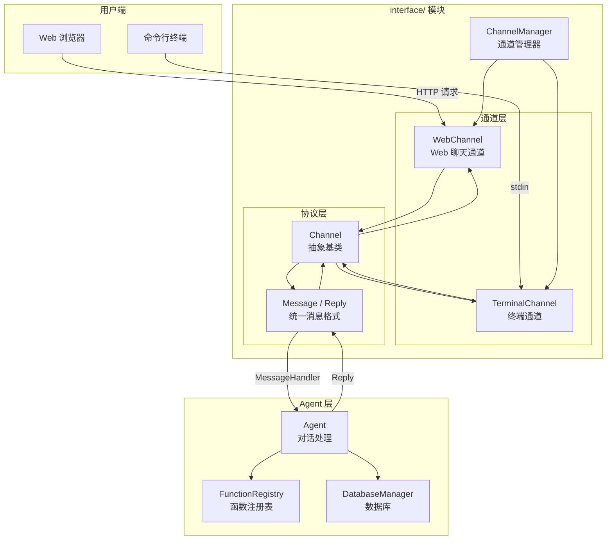

# Interface 模块设计文档

## 1. 模块概述

`interface/` 是用户交互通道管理模块，将用户与 Agent 之间的交互界面独立抽象出来，支持通过不同渠道（Web、终端等）与 Agent 进行文字交互。

### 设计目标

- **通道抽象**：通过 Channel 基类统一所有交互通道，新增通道只需实现接口
- **多通道并行**：多个通道可以同时运行，通过 ChannelManager 统一管理
- **与 Agent 解耦**：通道不关心业务逻辑，通过 MessageHandler 回调与 Agent 交互

### 核心使用场景

用户通过 Web 或终端发送文字 → Channel 接收并转换为统一 Message → Agent 处理并返回 Reply → Channel 回复用户

---

## 2. 架构分层



---

## 3. 文件结构

```
interface/
├── __init__.py              # 模块入口，统一导出
├── base.py                  # Channel 抽象基类、Message/Reply 数据类
├── manager.py               # ChannelManager 通道管理器
├── terminal/                # 终端通道
│   ├── __init__.py
│   └── channel.py           # TerminalChannel
└── web/                     # Web 通道
    ├── __init__.py
    └── channel.py           # WebChannel (聊天 UI + REST API)
```

---

## 4. 核心数据类

### 4.1 MessageType

```python
class MessageType(Enum):
    TEXT = "text"       # 文本消息
    IMAGE = "image"     # 图片消息
    FILE = "file"       # 文件消息
```

### 4.2 Message（入站消息）

```python
@dataclass
class Message:
    type: MessageType        # 消息类型
    content: str             # 文本内容或媒体路径
    sender_id: str           # 发送者标识
    sender_name: str         # 发送者显示名
    session_id: str          # 会话标识
    channel_name: str = ""   # 来源通道（自动填充）
    timestamp: datetime      # 时间戳
    extra: Dict[str, Any]    # 通道特定数据
```

### 4.3 Reply（出站回复）

```python
@dataclass
class Reply:
    type: MessageType        # 回复类型
    content: str             # 回复内容
```

### 4.4 MessageHandler

```python
MessageHandler = Callable[[Message], Awaitable[Optional[Reply]]]
```

所有通道通过此回调与 Agent 交互。典型实现：

```python
async def agent_handler(message: Message) -> Optional[Reply]:
    response = await agent.chat(message.content)
    return Reply(type=MessageType.TEXT, content=response["content"])
```

---

## 5. Channel 基类

```python
class Channel(ABC):
    def __init__(self, name: str, message_handler: Optional[MessageHandler] = None)
    
    # 必须实现
    async def startup(self)              # 启动通道
    async def shutdown(self)             # 关闭通道
    async def send(self, session_id, reply)  # 发送回复
    
    # 已实现（通常不需要重写）
    async def handle(self, message) -> Optional[Reply]  # 处理消息
    def set_message_handler(self, handler)               # 设置回调
    
    # 属性
    @property
    def is_running(self) -> bool
```

---

## 6. 通道实现

### 6.1 TerminalChannel（终端通道）

用于开发调试，在命令行中与 Agent 文字对话。

```python
channel = TerminalChannel(message_handler=handler, user_name="我", bot_name="助手")
await channel.startup()
await channel.run_loop()  # 进入交互循环
```

**特性**：
- stdin/stdout 交互
- 支持退出（quit/exit/q）和清屏（clear/cls）
- 不阻塞事件循环

### 6.2 WebChannel（Web 聊天通道）

基于 FastAPI 提供 Web 聊天界面和 REST API。

```python
channel = WebChannel(message_handler=handler, host="0.0.0.0", port=8080)
await channel.startup()
# 访问 http://localhost:8080/chat
```

**路由**：
| 路由 | 方法 | 说明 |
|------|------|------|
| `/chat` | GET | 聊天页面 |
| `/api/chat` | POST | 聊天 API |
| `/health` | GET | 健康检查 |

**API 格式**：
```bash
# 请求
POST /api/chat
{"content": "今天营业额多少？", "session_id": "xxx"}

# 响应
{"reply": "今天营业额共计 ¥3,200", "type": "text"}
```

---

## 7. ChannelManager 通道管理器

```python
manager = ChannelManager(message_handler=agent_handler)
manager.register(WebChannel(port=8080))
manager.register(TerminalChannel())
await manager.start_all()

# 查看状态
manager.list_channels()          # ['web', 'terminal']
manager.get_running_channels()   # ['web', 'terminal']

await manager.stop_all()
```

---

## 8. 完整使用示例

```python
import asyncio
from agent import Agent, create_provider, FunctionRegistry
from database import DatabaseManager
from interface import ChannelManager, WebChannel, TerminalChannel
from interface.base import Message, Reply, MessageType

# 1. 初始化 Agent
provider = create_provider("minimax", api_key="sk-api-...")
registry = FunctionRegistry()
db = DatabaseManager("sqlite:///data/store.db")
# ... 注册数据库函数到 registry ...
agent = Agent(provider, function_registry=registry, system_prompt="你是商业管理助手...")

# 2. 定义消息处理回调
async def message_handler(message: Message) -> Reply:
    response = await agent.chat(message.content)
    return Reply(type=MessageType.TEXT, content=response["content"])

# 3. 创建并启动通道
manager = ChannelManager(message_handler=message_handler)
manager.register(WebChannel(port=8080))

async def main():
    await manager.start_all()
    # Web: http://localhost:8080/chat
    try:
        await asyncio.Event().wait()  # 保持运行
    except KeyboardInterrupt:
        await manager.stop_all()

asyncio.run(main())
```

---

## 9. 扩展指南

### 添加新通道

1. 在 `interface/` 下创建新目录（如 `dingtalk/`）
2. 继承 `Channel` 基类
3. 实现 `startup()`, `shutdown()`, `send()` 三个方法
4. 在 `__init__.py` 中注册导出

```python
class DingTalkChannel(Channel):
    def __init__(self, message_handler=None, ...):
        super().__init__("dingtalk", message_handler)
    
    async def startup(self):
        # 启动钉钉消息接收
        self.running = True
    
    async def shutdown(self):
        self.running = False
    
    async def send(self, session_id, reply):
        # 调用钉钉 API 发送消息
        ...
```

---

## 10. 配置参考

### .env 文件

```env
# Web 通道
WEB_HOST=0.0.0.0
WEB_PORT=8080
```

---

## 11. 设计决策

### Q1: 为什么统一消息格式而不是直接透传？

**决策**：所有通道消息统一转换为 `Message` 格式。

**理由**：
- Agent 只需处理一种消息格式，不关心来源通道
- 新增通道不需要修改 Agent 代码
- 统一的消息处理流程
